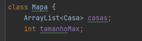
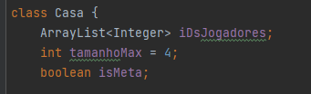
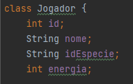
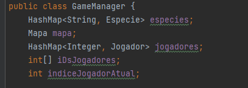
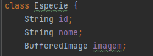

Link para o vídeo : https://youtu.be/cnf5OerLXkI

A classe gameManager tem como funcionalidade controlar o jogo,
vimos que faria sentido ter um objeto que representasse o terreno do jogo:

 - A classe Mapa, nesta é guardado o número máximo de casas, bem como um conjunto de casas.

 - A classe Casa guarda os IDs dos jogadores presentes, o número máximo de jogadores na casa e
uma variável isMeta para se saber se a casa deve ser impressa com a imagem da meta.

 - A classe Jogador tem um ID e um nome para identificar um jogador, energia, 
que tem como a função de ver se o jogador consegue andar casas para a frente 
quando for a sua vez de jogar, e, por fim o ID da espécie do jogador. 

 - Na classe gameManager, foi necessária uma variável para guardar o indice do Jogador 
atual, uma variável que guarda os IDs dos jogadores e, finalmente, um conjunto de espécies       

 - A classe Especie, contem um ID, um nome e uma imagem para distinguir cada Especie.

